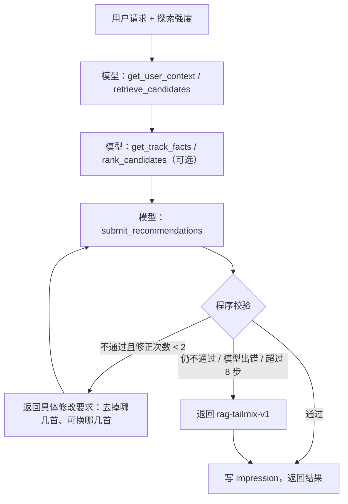

# 阶段 3：长尾排序、反馈与离线评估

> 对应 TODO.md 第 7 节。完成日期：2026-09-27。全部在 Mac 本机运行，不需要 GPU（agent 调用 DeepSeek API）。

## 目标

1. 在阶段 2 的候选集上建立**确定性**的排序 baseline：只看相关性，以及固定配额的长尾混排；
2. 接上 ReAct agent：模型只能调用工具、只能在候选集内选歌，违规就退回确定性排序；
3. 建立“曝光 → 反馈”的记录闭环（没有曝光就没有反馈）；
4. 建立一套固定的离线指标，阶段 4（SFT）和阶段 5（GRPO）直接复用。

## 做出的决策

| 问题 | 决定 |
|---|---|
| Recall/NDCG 的“正确答案” | 选项 a：ListenBrainz Labs **相似录音**（基于真实收听会话），存为 `eval/weak_positives_v1.json`，**只用于评估，不进 reward** |
| 旧的“DeepSeek 提名 + Spotify 确认存在”代码 | 删除（`domain/discovery.py`、`domain/generators.py` 及相关工具、提示词、测试） |
| 验收标准（事先约定） | 固定混排的平均相关性 ≥ 只看相关性的 90%，且长尾曝光至少提升 50% |
| LLM 的角色 | DeepSeek 作为 ReAct agent 调用新工具；接口走 OpenAI 兼容格式，阶段 4/5 换成自己微调的模型时循环不变 |
| 思考过程 | 不保存隐藏思维；每次工具调用必须带一句可见的 `summary` |

## 一、原理（面试准备）

### 1. 召回和排序的分工

推荐系统通常分两步：**召回**从全库里快速找出几百个“可能相关”的候选（阶段 2 的 RAG），**排序**在这几百个里仔细打分、挑出最后展示的 10 首（本阶段）。召回追求“别漏”，排序追求“挑得准、搭配得好”。长尾目标主要在排序这一步实现：召回保证候选里有足够的冷门歌，排序决定放几首、放哪几首。

### 2. 为什么要先做确定性 baseline

- 可复算：同样的输入永远得到同样的输出，出了问题能定位；
- 有参照：后面的 agent、SFT、GRPO 都要和它比，才能说明“学到了什么”；
- 当兜底：模型出错、超时或违规时，系统退回它，保证永远有合法结果。

### 3. 多样性与 MMR

只按分数挑，前 10 首往往高度相似（同一艺人、同一张专辑）。MMR（最大边际相关）在贪心挑选时，把“和已选歌的相似度”作为扣分项：`得分 = 相关性 + λ × (1 − 与已选歌最大相似度)`。本项目 λ = 0.2，另加每位艺人最多 2 首的硬上限。

### 4. ReAct

ReAct = Reasoning + Acting：模型不直接吐答案，而是循环“想一步 → 调一个工具 → 看结果 → 再想”，直到调用“提交”工具。好处是每个结论都有工具返回的事实作依据，并且过程可记录、可审计。本项目的约束：

- 模型只能用 5 个工具，歌曲只能来自 `retrieve_candidates` 返回的候选集；
- 提交后由**程序**校验，不信任模型的自我检查；
- 校验失败时把具体问题反馈给模型让它修正（最多 2 次），仍失败就退回确定性排序。

这套循环和具体模型无关：阶段 4/5 训练出的模型，只要支持 tool calling，就能直接替换 DeepSeek。

### 5. 推荐系统的离线指标

| 类别 | 指标 | 含义 |
|---|---|---|
| 准确性 | Recall@K、NDCG@K | 前 K 首里命中了多少“正确答案”；NDCG 还看命中的位置 |
| 长尾 | Tail Exposure、Tail Coverage、Novelty | 推荐里冷门歌的比例；覆盖了多少冷门歌；平均冷门程度 |
| 多样性 | Intra-list Diversity、Catalog/Artist Coverage | 一个列表内部的差异；所有推荐覆盖了多大的曲库 |
| 意外发现 | Serendipity | 相关、但不是“显而易见的 baseline 会推荐的”歌所占比例 |
| 可靠性 | Hallucination Rate、Constraint Pass、Evidence Accuracy | 候选集外的歌、违反约束、理由里编造事实的比例 |

**弱正例的问题**：离线“正确答案”来自真实收听日志，天然偏向热门歌。长尾推荐的 Recall 下降是预期的，不能单看 Recall 判断好坏，所以必须同时看长尾指标，并在阶段 6 用真人反馈验证。

## 二、本项目的实现

### 代码结构

| 文件 | 作用 |
|---|---|
| `ranking/ranker.py` | 6 个打分分量 + 惩罚；`rag-rel-v1`、`rag-tailmix-v1`；配额 `slot_plan`；权重版本 `rank-w1` |
| `ranking/validator.py` | 选择校验；返回错误文本和结构化 `violations` |
| `ranking/metrics.py` | 全部离线指标（`metrics-v1`） |
| `ranking/positives.py` | 从 ListenBrainz Labs 拉相似录音，生成 `weak-pos-v1` |
| `ranking/evaluate.py`、`cli.py` | 固定查询集上跑三个系统，输出 JSON / CSV / Markdown |
| `agent/llm.py` | OpenAI 兼容客户端（`AGENT_LLM_*` 或 `DEEPSEEK_*` 环境变量）；测试用的脚本化模型 |
| `agent/tools.py` | 5 个工具及参数校验 |
| `agent/loop.py` | ReAct 循环、修正提示 `repair_hints`、确定性退回 |
| `agent/service.py` | `RecommenderV2`：推荐、写 impression、记录反馈 |
| `web/app.py` | `/api/v1/agent/recommend`、`/feedback` 对 V2 用户走新服务 |

### 排序打分

| 分量 | 计算 |
|---|---|
| relevance | 阶段 2 的混合相关性（语义百分位 × 0.5 + 标签百分位 × 0.5） |
| tail_score | 1 − 全网热度百分位 |
| tail_relevance | relevance × tail_score（冷门且相关才高） |
| novelty | 0.5 ×（不是种子艺人）+ 0.5 ×（1 − 与最近种子的相似度） |
| diversity | 1 − 与已选歌的最大相似度（贪心时计算） |
| exploration_fit | 1 − abs(tail_score − 探索强度) |

惩罚：同艺人已选（只对混排，0.3/首）、用户听过（1.0）、近重复（相似度 > 0.97，0.5）。

`rag-tailmix-v1` 的配额随探索强度变化（count = 10）：

| 探索强度 | 相关 | 长尾 | 探索 |
|---|---|---|---|
| 0.1 | 9 | 1 | 0 |
| 0.5 | 6 | 3 | 1 |
| 0.9 | 3 | 5 | 2 |

上下限：长尾 1 首到 50%，探索最多 20%，相关至少 30%。每首歌的 `score_breakdown` 保存全部分量、惩罚和权重版本。

### Agent 的一次推荐



系统提示词给出目标长尾区间（count = 10 时：探索 0.1 → 1–2 首，0.5 → 3–5 首，0.9 → 5–8 首），这只是引导，程序只强制最少长尾数。

### 反馈

- 每首展示的歌写一条 `ImpressionV2`（名次、分档、召回通道、策略版本、run_id）；
- `FeedbackV2` 必须引用 impression_id，否则拒绝写入：**没有曝光就没有反馈**，未展示的歌不会被当成负例；
- 事件：开始播放、播放进度、听完、30 秒内跳过、喜欢、收藏、隐藏；
- 问卷：此前是否听过、相关性、发现价值、是否“太陌生”；拒绝原因区分“不喜欢这首”和“当前不想探索”；
- 标记“听过”的歌写入用户上下文，之后排序时扣分；“隐藏”的歌加入排除列表，之后不再推荐。

## 三、迭代过程

| 版本 | 改动 | Agent 长尾曝光 | Agent 相关性 | 退回 |
|---|---|---|---|---|
| ranking-v1 | 第一版提示词 | 73.9% | 0.9782 | 0/13 |
| ranking-v2 | 平衡提示词 + 目标长尾区间 | 42.3% | 0.9847 | 2/13 |
| ranking-v3 | 具体修改要求 + 修正次数 1 → 2 | 39.2% | 0.9873 | 0/13 |

- v1：模型把“长尾”理解成越多越好，平均 7 首以上冷门歌，相关性明显下降；
- v2：长尾比例回到目标区间，但两次（Pink Floyd、Mansun）因同艺人超过 2 首被校验拒绝；原来的反馈只说“超过上限”，模型修正一次仍失败；
- v3：反馈里列出超限的具体歌曲、要去掉几首、可替换的候选（最相关、未被选、艺人未满额），并允许修正 2 次，退回率降到 0。

还有两处小改动：同艺人软惩罚只对混排生效（baseline 只保留硬上限）；评估里新增 `steps`、`repairs` 字段，便于以后统计修正了几次（v3 的结果是在加这两个字段之前跑的）。

## 四、结果（`runs/ranking-v3/`）

13 条固定查询（与阶段 2 相同），K = 10，索引 `idx-catalog-20260926-baai-bge-m3-doc-v2`。

| 指标 | rag-rel-v1 | rag-tailmix-v1 | agent-react-v1 |
|---|---|---|---|
| Recall@10 | 0.115 | 0.092 | 0.100 |
| NDCG@10 | 0.141 | 0.063 | 0.097 |
| 长尾曝光 | 23.1% | 46.9% | 39.2% |
| 平均相关性 | 0.9955 | 0.9823 | 0.9873 |
| 新颖度 | 0.042 | 0.108 | 0.089 |
| 列表内多样性 | 0.158 | 0.189 | 0.178 |
| 意外发现度 | 0 | 0.439 | 0.277 |
| 幻觉率 | 0 | 0 | 0 |
| 约束通过率 | 100% | 100% | 100% |
| 证据准确率 | 100% | 100% | 97.7% |
| 不同歌曲数 | 76 | 72 | 83 |

**验收**：固定混排相关性为只看相关性的 98.7%（要求 ≥ 90%），长尾曝光 +103%（要求 ≥ +50%），**通过**。

按探索强度，agent 的长尾比例为 0.1 → 20%、0.5 → 40%、0.9 → 60%，都在目标区间内。agent 平均 9.2 秒一次，最长 11.3 秒。

**怎么看这些数字**

- agent 介于两个 baseline 之间：比只看相关性多一倍冷门歌，相关性只低 0.8%；
- rag-rel-v1 的意外发现度为 0 是定义决定的（它本身就是“显而易见的 baseline”）；
- 所有系统的 Recall 都只有 0.1 左右，原因见下文第 1 条局限。

## 五、已知限制

1. **弱正例全部是热门歌**：曲库中 Pink Floyd 分支 81 首、Oasis 分支 131 首弱正例，tail 为 0。Recall/NDCG 衡量的是“熟悉度”，长尾策略 Recall 下降是预期结果；长尾推荐的好坏要靠阶段 6 的真人反馈判断。
2. **热门歌集中（hubness）**：13 × 10 = 130 次推荐只有 72–83 首不同的歌，某些歌在多条查询里反复出现。
3. **summary 和 reason 不经校验**：agent 说“选了 5 首长尾”实际是 6 首这类不一致仍会出现；证据准确率只检查数字，130 条理由中有 3 条引用了证据里没有的数字；reason 偶有主观措辞（“氛围迷幻”）。
4. **延迟**：agent 约 9 秒，确定性排序是毫秒级。线上需要流式显示过程或先给 baseline 结果。
5. **评估集小**：13 条查询，结果有波动；v2 → v3 的退回率变化还需要更多查询确认。

## 六、如何复现

```bash
cd ~/Desktop/rateyourDJ
# 生成弱正例（ListenBrainz Labs，结果缓存）
PYTHONPATH=src python -m rateyourdj.ranking.cli build-positives
# 只跑两个确定性 baseline（不花 API）
PYTHONPATH=src python -m rateyourdj.ranking.cli eval --run-dir runs/ranking-baselines
# 加上 agent（需要 .env 里的 DEEPSEEK_API_KEY，或 AGENT_LLM_BASE_URL / AGENT_LLM_MODEL / AGENT_LLM_API_KEY）
PYTHONPATH=src python -m rateyourdj.ranking.cli eval --with-agent --run-dir runs/ranking-v3

# 单次推荐与反馈
PYTHONPATH=src python -m rateyourdj.agent.cli recommend "像 Wish You Were Here 那样但更冷门" --exploration 0.7
PYTHONPATH=src python -m rateyourdj.agent.cli feedback imp_xxx --event liked --heard-before no --discovery-value 5
```

## 下一步：阶段 4（SFT + LoRA）

- 用本阶段的 agent 轨迹（通过校验、没有退回的）和确定性 oracle 生成 SFT 样本，`eval_only` 字段训练前剥离；
- 选定 0.5B–3B 的开放权重模型，用 LoRA 做监督微调，让它学会工具调用格式和长尾选择；
- 用本阶段同一套查询和指标评估微调模型，再接回 ReAct 循环替换 DeepSeek。

**阶段 4 需要 GPU**：数据构造和小规模冒烟测试可以在 Mac 上做，正式训练需要一台 GPU 服务器（24 GB 显存可以跑 3B 以下模型的 LoRA）。开始前我会先把服务器要求说清楚。
